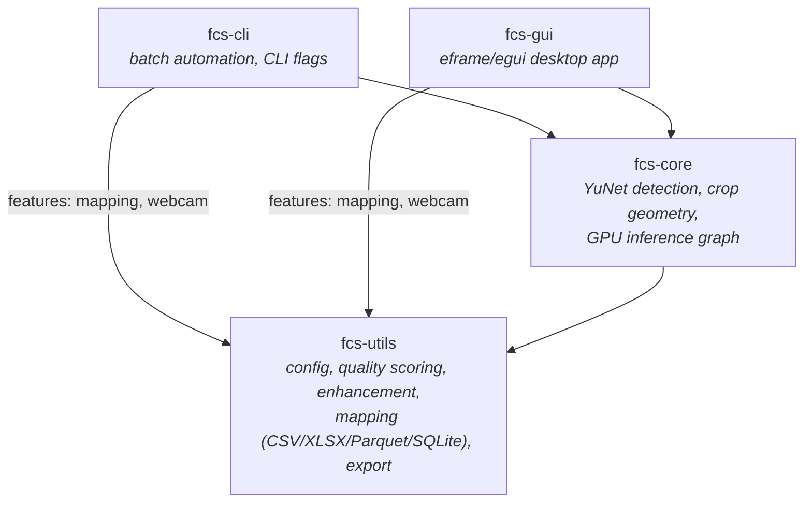

# Architecture Overview

The Face Crop Studio workspace is split into four crates that collaborate to deliver face detection, cropping, and post-processing across CLI and GUI front-ends.

```text
Root Cargo.toml
├── fcs-core     # Detection, cropping, presets, ONNX integration
├── fcs-utils    # Shared config, quality scoring, enhancement & export helpers
├── fcs-cli      # Command-line entry point and batch automation
└── fcs-gui      # eframe/egui desktop application
```

## How the Crates Talk

Dependencies point downward: the two front-ends depend on `fcs-core` and
`fcs-utils`, `fcs-core` depends on `fcs-utils`, and `fcs-utils` is the
dependency-free foundation. Nothing depends back up toward the front-ends, so
the detection/crop/enhance logic stays UI-agnostic and is exercised by both
surfaces (and the test suite) identically.



| Crate | Depends on | Role |
|-------|------------|------|
| `fcs-utils` | — | Foundation: config structs, Laplacian quality scoring, CPU+GPU enhancement, mapping ingestion, and output encoders. |
| `fcs-core` | `fcs-utils` | Detection and geometry: YuNet ONNX loading, preprocessing/postprocessing, `calculate_crop_region`, and the custom WGSL inference graph. |
| `fcs-cli` | `fcs-core`, `fcs-utils` | Synchronous batch front-end with GPU auto-detection and context pooling. |
| `fcs-gui` | `fcs-core`, `fcs-utils` | Desktop front-end; pushes detection/enhancement onto background Rayon tasks and shares wgpu context with eframe. |

This document focuses on the crop calculation pipeline introduced in Phase 4 and extended through Phase 9.

## Data Flow

1. **Detection** – `YuNetDetector` (in `fcs-core`) runs the ONNX model via `tract-onnx`, returning `DetectionOutput` records that contain bounding boxes, landmarks, and confidence scores.
2. **Crop Derivation** – `calculate_crop_region` in `fcs-core/src/cropper.rs` transforms a detection into a bounded `CropRegion`. The algorithm:
   - clamps the configured face-height percentage to `[1, 100]`,
   - derives a source height that will yield the requested face coverage once resized,
   - mirrors the output aspect ratio to compute the source width,
   - applies positioning logic (center, rule of thirds, custom offsets),
   - and clamps the resulting rectangle to the original image dimensions.
3. **Crop Extraction** – `crop_face_from_image` uses `image::imageops::crop_imm` followed by a Lanczos3 resize to obtain the final output dimensions. This abstraction is reused by both the CLI and GUI.
4. **Enhancement & Quality** – `fcs-utils` kicks in next:
   - `apply_enhancements` runs the optional enhancement pipeline (auto color, exposure, contrast, saturation, unsharp mask, skin smoothing, red-eye removal, and background blur).
   - `estimate_sharpness` computes Laplacian variance to classify the crop as Low/Medium/High quality. These scores inform automation like `QualityFilter::select_best_index` and filename suffixing.
5. **Export** – `save_dynamic_image` encodes the image (PNG/JPEG/WebP), optionally injects metadata (original EXIF, crop configuration, quality metrics), and writes to disk.

The CLI stitches these steps together in synchronous code paths. The GUI pushes detection and enhancement workloads onto background Rayon tasks to keep the egui frame loop responsive, caching results in `DetectionCacheEntry`s keyed by model configuration.

## YuNet Model Loading

`YuNetModel::load` first attempts to run `tract-onnx`'s `into_optimized()` pipeline, which performs operator fusion and constant folding. When tract cannot optimize the graph, the loader logs a warning and falls back to the decluttered graph via `into_decluttered()`. This mode keeps inference functional but roughly doubles end-to-end inference latency because key optimizations are skipped. Watch for the warning in CLI/GUI logs to diagnose unexpected slowdowns or incompatible ONNX exports. The upstream `face_detection_yunet_2023mar.onnx` file, for example, encodes contradictory spatial hints (Conv_0 claims its output is `1×16×160×160` even though the input tensor is `1×3×320×320`), so tract refuses to type-check the network. We ship the sanitized `face_detection_yunet_2023mar_640.onnx` export—which locks the input to `640×640`—as the default model to keep tract on the fast path.

## Crop History & Undo/Redo

The GUI maintains a circular history buffer (max 100 entries) of `CropSettings` snapshots. Interactions that affect framing—preset switches, slider changes, keyboard nudges—call `push_crop_history`, making undo/redo operations deterministic. This behaviour is covered by the smoke tests in `fcs-gui/src/main.rs`.

## Benchmarks

`fcs-core/benches/crop_enhance.rs` provides a Criterion micro-benchmark for the combined crop + enhancement pipeline. It generates a synthetic high-frequency region, runs `crop_face_from_image`, and immediately applies the enhancement stack. Use `cargo bench -p fcs-core crop_enhance` to track latency when tuning algorithms.

### GPU Pipeline Architecture

```mermaid
graph TD
    HostImage[Host Image (RAM)] -->|Upload Texture| GPU[GPU Memory]
    
    subgraph "Preprocessing (WGSL)"
        GPU -->|Texture| PreprocShader[Preprocess Shader]
        PreprocShader -->|Resize + RGB->BGR| PreprocOutput[Tensor (CHW)]
    end
    
    subgraph "Inference (Custom WGSL)"
        PreprocOutput -->|Input| Conv2D[Conv2D Layer]
        Conv2D -->|Feature Map| BatchNorm[BatchNorm]
        BatchNorm -->|Activation| ReLU[ReLU/Sigmoid]
        ReLU -->|Next Layer| Conv2D
        ReLU -->|Final| OutputTensors[Output Tensors]
    end
    
    subgraph "Postprocessing"
        OutputTensors -->|Download| CPU_Post[CPU Postprocess]
        CPU_Post -->|NMS & Decode| Detections[Detections list]
    end
    
    subgraph "Enhancement (WGSL)"
        Detections -->|Crop Region| EnhanceShader[Enhancement Shaders]
        EnhanceShader -->|Apply Filters| EnhancedTex[Enhanced Texture]
    end
    
    EnhancedTex -->|Display| GUI[GUI Preview]
    EnhancedTex -->|Download| Disk[Export to Disk]
```

### GPU vs CPU Performance

| Operation                      | CPU (Ryzen 5950X) | GPU (GTX 1080 Ti) | Speedup |
|--------------------------------|-------------------|-------------------|---------|
| Preprocessing (Quality Resize) | ~162 ms           | ~51 ms            | ~3.2x   |
| Inference (640x640)            | ~20 ms            | ~15 ms            | ~1.3x   |
| Enhancement (Full Pipeline)    | ~180 ms           | ~12 ms            | ~15x    |

*Note: GPU preprocessing includes PCIe transfer overhead which dominates for single images. Batch throughput sees higher gains.*

### GPU Inference Determinism

The custom WGSL YuNet inference path (`gpu.inference: true`) is **not bit-deterministic across runs**. GPU compute shaders perform parallel float reductions during convolution and the accumulation order is scheduler-dependent. Most of the time this manifests as sub-ULP wobble in detection scores and bbox coordinates, but occasionally — especially on borderline detections or images with multiple face-like patterns — it produces visibly different outputs.

Empirically on a 1239-image batch, with `gpu.inference: true`:

- **~99%** of images produce identical detection sets across batch runs.
- **~1%** show variance in their detection list. The breakdown of that 1%:
  - About half are *secondary* detections around a single face (near-duplicate boxes from YuNet's stride-8/16/32 anchors). NMS and the post-NMS centroid dedup pass catch most of these.
  - About a third are *threshold-boundary flicker* — a borderline detection's score wobbles across `score_threshold`, so it's included in some runs and not others.
  - The remainder is genuine model-level wobble where a clear face produces meaningfully different scores between runs.

With `quality_rules.auto_select_best_face: true` (the GUI default), only the top detection per image affects output, so the user-visible drift is closer to **~0.3% of images**. CPU inference (`gpu.inference: false`) routes through `tract` and removes the GPU-side source of wobble — recommended when reproducibility matters more than batch throughput.

#### Mitigations in code

- `nms_threshold: 0.2` (down from the YuNet upstream 0.3) — more aggressive overlap suppression absorbs IoU jitter for clearly-overlapping boxes.
- `fcs-core::nms::dedup_close_centers` — post-NMS pass that drops detections whose centers are within 50% of the larger bbox's longest edge. Catches the multi-scale duplicates that low-IoU NMS lets through. Wired into `apply_postprocess`.

#### Diagnostic logging

There's a `log_detection_diag` helper in `fcs-gui/src/core/export.rs` (currently commented out) that logs per-image detection counts and sorted score lists at `debug` level. Uncomment its definition and call site in `run_batch_job`, then run two batches with `RUST_LOG="fcs_gui::core::export=debug"`, capture the `[batch-diag]` lines from each into a file, and diff with `compare_batch_diag.py` to see which images are flipping. Re-comment when done.

## Testing Matrix

| Area                 | Location                               | Purpose                                         |
|----------------------|----------------------------------------|-------------------------------------------------|
| Crop edge cases      | `fcs-core/src/cropper.rs`              | Property + unit tests for clamping, aspect ratio, offsets |
| Golden crop regions  | `fcs-core/tests/golden_crop_regions.rs` | Locks exact `CropRegion` output for representative scenarios |
| Face extraction      | `fcs-core/src/face_cropper.rs`         | Ensures resize dimensions match configuration   |
| Quality scoring      | `fcs-utils/src/quality.rs`             | Threshold bucketing, filters, suffix logic      |
| Enhancement pipeline | `fcs-utils/src/enhance.rs`             | Unit + pipeline parity tests                    |
| Full crop workflow   | `fcs-core/tests/full_crop_workflow.rs` | Integration test from detection to export       |
| CLI scenarios        | `fcs-cli/tests/*.rs`                   | Snapshot, batch, naming, enhancement workflows  |
| GUI smoke tests      | `fcs-gui/src/main.rs` (test module)    | Crop adjustments, undo/redo, preset application |
| GUI visuals          | `fcs-gui/tests/screenshot.rs`          | Snapshot-based overlay verification             |

These layers give confidence that the crop calculation flow remains stable across both user interfaces while providing hooks to measure and iterate on performance.
