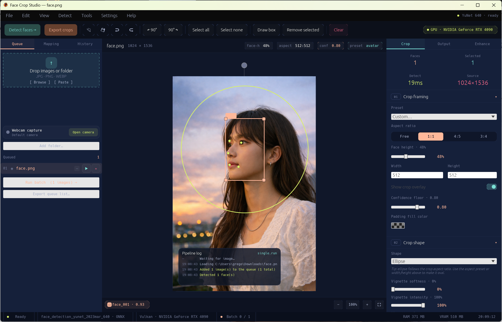
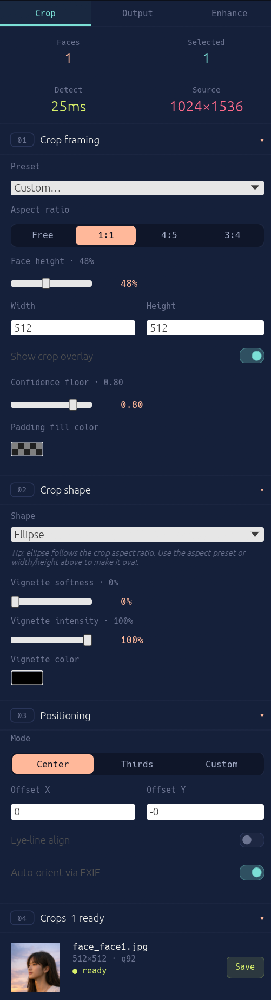
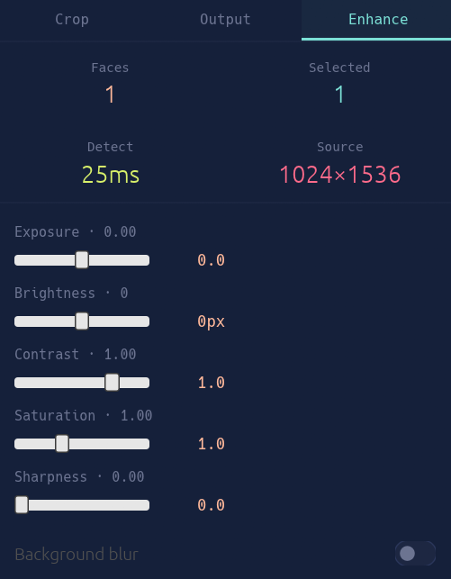
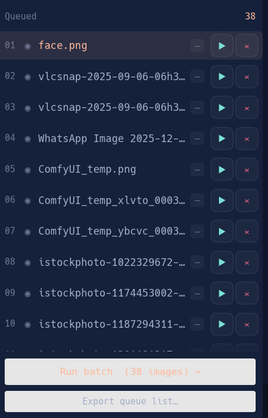
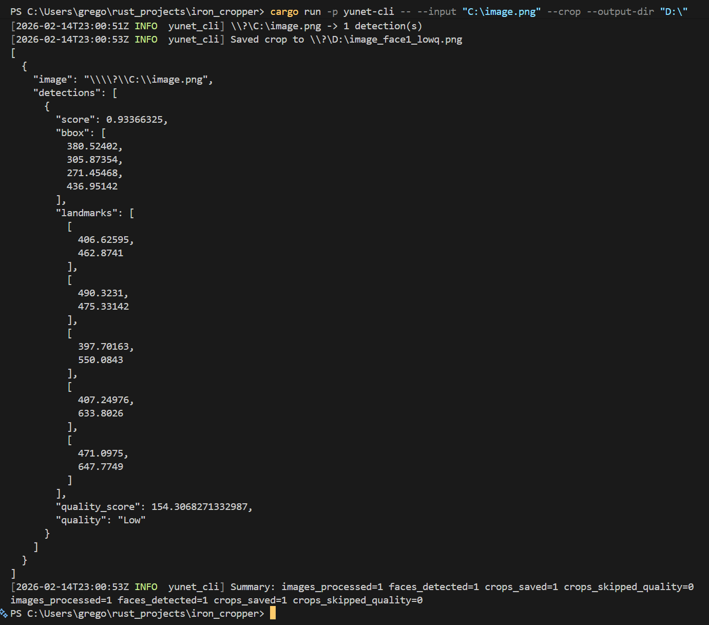

# Screenshot gallery — layout candidates

Preview this file (VS Code: <kbd>Ctrl</kbd>+<kbd>Shift</kbd>+<kbd>V</kbd>, or open on a
branch in GitHub) and pick the layout you like. Tell me the letter and I'll move it
into `README.md` and delete this file.

All options use the real `screenshots/*.png` files and stay within GitHub's HTML
allowlist (no CSS/lightbox is possible in a GitHub README — that only works if the
page is hosted on your own site).

---

## Option A — Hero + uniform 3-up row

Big hero, then one tidy symmetric row of the three side panels. Clean and modern.

   
  <strong>Desktop workspace</strong> — detection overlays, crop preview, queue, and export controls.

<table>
  <tr>
    <td width="33%" align="center" valign="top">
      
    </td>
    <td width="33%" align="center" valign="top">
      
    </td>
    <td width="33%" align="center" valign="top">
      
    </td>
  </tr>
  <tr>
    <td align="center" valign="top"><strong>Crop setup</strong> Presets, sizing, shape, padding, positioning.</td>
    <td align="center" valign="top"><strong>Enhancement</strong> Colour, sharpness, smoothing, blur.</td>
    <td align="center" valign="top"><strong>Batch queue</strong> Multi-image status and export.</td>
  </tr>
</table>

  
<strong>CLI automation example</strong>

  

     
    Detection metadata, crop coordinates, quality scoring, and processing summary.
  

---

## Option B — Hero + 2×2 quadrant grid

Hero, then a balanced 2×2 grid that promotes the CLI shot into the grid (no
hidden `
`). Everything visible at a glance; more vertical space used.

   
  <strong>Desktop workspace</strong> — detection overlays, crop preview, queue, and export controls.

<table>
  <tr>
    <td width="50%" align="center" valign="top">
       
      <strong>Crop setup</strong> Presets, sizing, shape, padding, positioning.
    </td>
    <td width="50%" align="center" valign="top">
       
      <strong>Enhancement</strong> Colour, sharpness, smoothing, background blur.
    </td>
  </tr>
  <tr>
    <td width="50%" align="center" valign="top">
       
      <strong>Batch queue</strong> Multi-image status and export progress.
    </td>
    <td width="50%" align="center" valign="top">
       
      <strong>CLI automation</strong> Batch-friendly output with metadata and quality scores.
    </td>
  </tr>
</table>

---

## Option C — Magazine layout (refined current)

Keeps the asymmetric feel of today's README but tidies widths and captions: tall
crop panel on the left, two stacked panels on the right.

   
  <strong>Desktop workspace</strong> — detection overlays, crop preview, queue, and export controls.

<table>
  <tr>
    <td width="40%" rowspan="2" align="center" valign="top">
       
      <strong>Crop setup</strong> Presets, target sizing, shape, padding, and positioning.
    </td>
    <td width="60%" align="center" valign="top">
       
      <strong>Enhancement controls</strong> Post-crop colour, sharpness, smoothing, and blur tuning.
    </td>
  </tr>
  <tr>
    <td align="center" valign="top">
       
      <strong>Batch queue</strong> Multi-image queue management and export progress.
    </td>
  </tr>
</table>

  
<strong>CLI automation example</strong>

  

     
    Detection metadata, crop coordinates, quality scoring, and processing summary.
  

---

## Option D — Hero + collapsible sections (compact)

Only the hero shows by default; each panel lives in its own collapsible section.
Keeps the README short and lets readers expand just what they care about.

   
  <strong>Desktop workspace</strong> — detection overlays, crop preview, queue, and export controls.

  
<strong>Crop setup</strong> — presets, sizing, shape, padding, positioning

  

  
<strong>Enhancement controls</strong> — colour, sharpness, smoothing, blur

  

  
<strong>Batch queue</strong> — multi-image status and export

  

  
<strong>CLI automation</strong> — batch-friendly terminal output

  

---

## Option E — Filmstrip (equal 4-up row)

Hero, then a single compact row of all four shots at equal width — most
"gallery-like" within GitHub's limits. Thumbnails are small; click to enlarge.

   
  <strong>Desktop workspace</strong> — detection overlays, crop preview, queue, and export controls.

<table>
  <tr>
    <td width="25%" align="center" valign="top"></td>
    <td width="25%" align="center" valign="top"></td>
    <td width="25%" align="center" valign="top"></td>
    <td width="25%" align="center" valign="top"></td>
  </tr>
  <tr>
    <td align="center"><strong>Crop setup</strong></td>
    <td align="center"><strong>Enhancement</strong></td>
    <td align="center"><strong>Batch queue</strong></td>
    <td align="center"><strong>CLI</strong></td>
  </tr>
</table>
