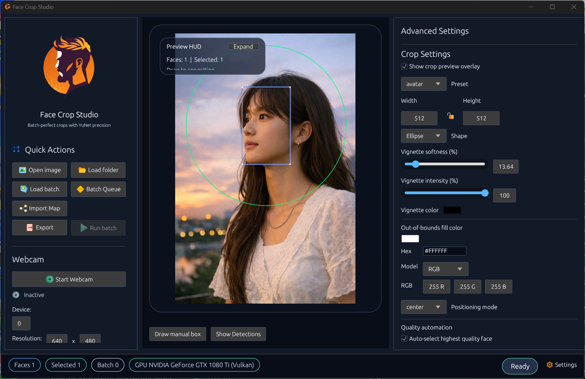
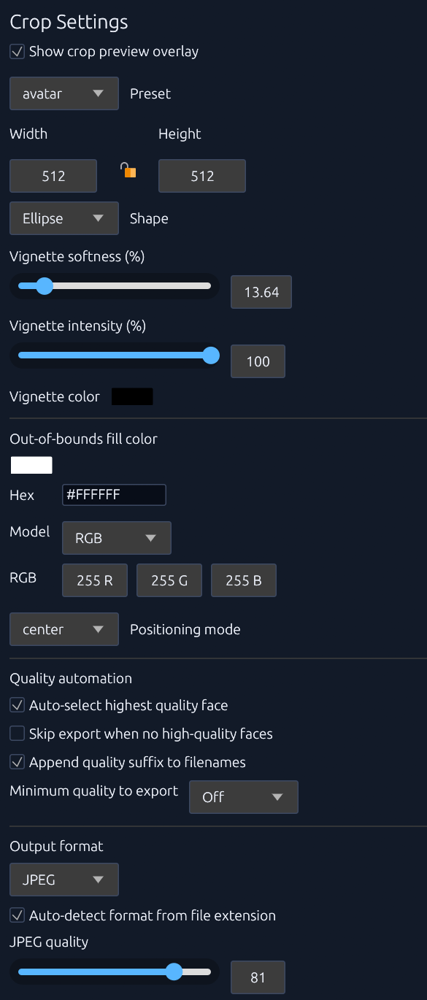
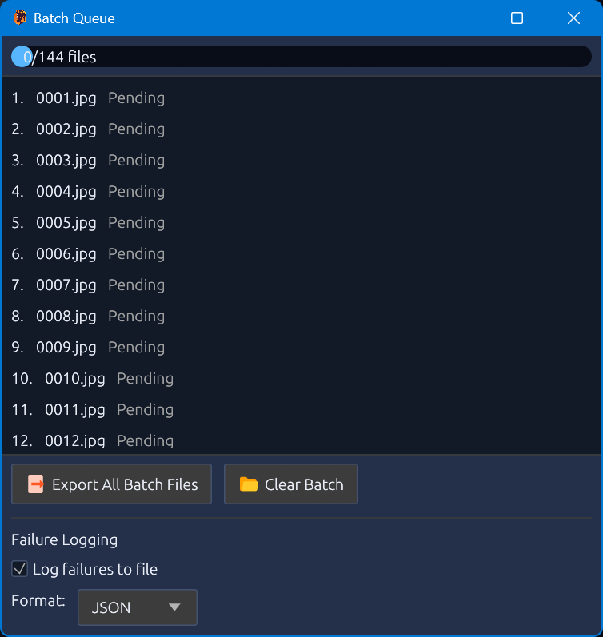
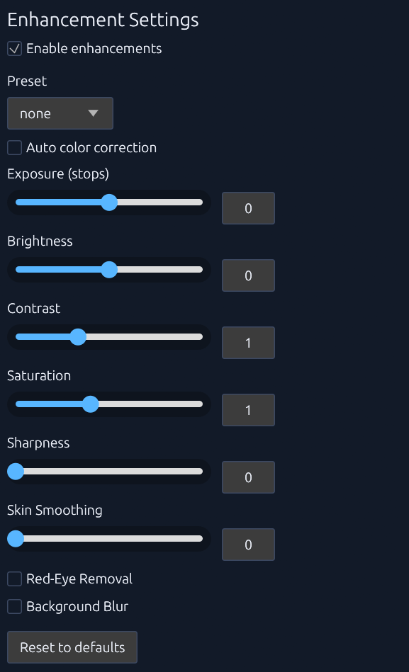
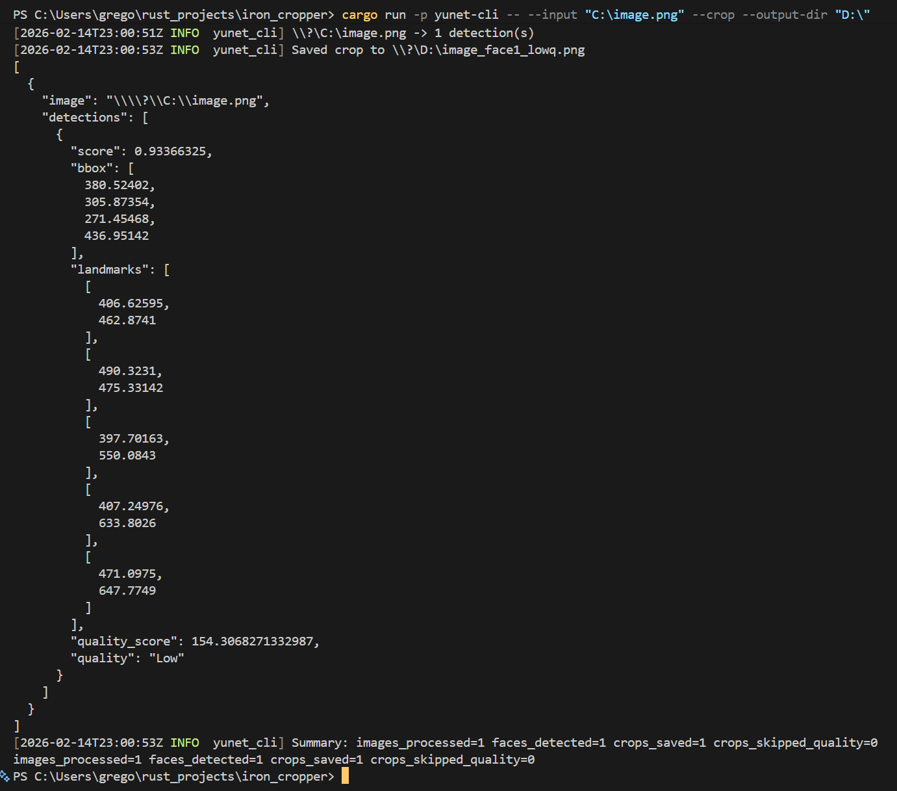

# Iron Cropper


Iron Cropper is a Rust workspace that wraps the YuNet face detector with deterministic cropping, quality analysis, enhancement, and export tooling. The project ships both a command-line workflow and an egui desktop application, backed by shared utilities for image processing, metadata handling, and configuration. Both CPU and GPU acceleration paths are supported via wgpu/WGSL compute shaders for preprocessing, enhancement, and custom YuNet inference.

## Crates

- **`yunet-core`** – Loads the YuNet ONNX model with `tract-onnx`, handles preprocessing/postprocessing, and implements the crop calculation logic. Includes GPU-accelerated preprocessing and custom GPU YuNet inference via WGSL compute shaders (see `ARCHITECTURE.md` for details).
- **`yunet-utils`** – Shared helpers: configuration structs, Laplacian-variance quality scoring, enhancement pipeline (CPU and GPU paths with 7 WGSL compute shaders), mapping system for CSV/Excel/Parquet/SQLite, and output encoders with metadata support.
- **`yunet-cli`** – Command-line frontend aimed at batch processing and automation with optional GPU acceleration (auto-detected, with fallback to CPU). Features GPU context pooling for efficient batch operations. Example invocations are documented in `docs/cli_recipes.md`.
- **`yunet-gui`** – eframe/egui desktop experience with live preview, crop adjustments, enhancements, history/undo, and batch export. Shares GPU context with eframe's wgpu backend for efficient rendering and compute. A user guide lives in `docs/gui_crop_guide.md`.

## Crop Features Overview

- **Preset sizing** – LinkedIn, Passport, Instagram, ID Card, Avatar, Headshot, plus an explicit “Custom” mode.
- **Face height targeting** – Configure how large the face should appear in the final crop (10–100%). The cropper preserves the requested aspect ratio and records any padding needed so crops can extend beyond the source image without distortion.
- **Padding color control** – Empty pixels introduced by out-of-bounds crops are filled with a configurable color (CLI `--crop-fill-color`, GUI color picker/hex/RGB/HSV inputs). Black remains the default.
- **Positioning modes** – Center, Rule of Thirds, or fully custom offsets with keyboard nudges and undo/redo support.
- **Quality automation** – Laplacian-variance scoring categorises crops into Low/Medium/High. Filters can auto-select the sharpest face, skip soft captures, and append quality suffixes.
- **Enhancement pipeline** – Optional post-crop adjustments (auto color, exposure, brightness, contrast, saturation, sharpening, skin smoothing, red-eye removal, and portrait background blur) with both CPU (pure Rust) and GPU (WGSL compute shaders) implementations.
- **Metadata & export** – Preserve, strip, or customise metadata. Exports support PNG, JPEG (with quality controls), and WebP.
- **Batch processing** – Both CLI and GUI support multi-image workflows with status tracking, filenames derived from templates, and quality-aware selection.
- **Clipboard & drag-and-drop import** – Drop/paste a single image to preview instantly, drop a folder/clipboard path list to enqueue its supported images for batch export, or drop CSV/XLSX/Parquet/SQLite tables to seed the mapping workflow.

## GPU Acceleration

The project includes comprehensive GPU acceleration via wgpu and WGSL compute shaders:

- **Preprocessing** – GPU-accelerated image resizing, color space conversion (RGB→BGR), and tensor layout transformation (HWC→CHW) with automatic fallback to CPU.
- **Enhancement shaders** – 7 WGSL compute pipelines: pixel adjustments (exposure/brightness/contrast/saturation), histogram equalization, Gaussian blur, bilateral filter (skin smoothing), red-eye removal, background blur, and shape masking.
- **Custom YuNet inference** – Full GPU implementation of YuNet face detection model using custom WGSL shaders for Conv2D, BatchNorm, pooling, and activation operations (see `docs/gpu_research.md`).
- **GPU context pooling** – CLI uses async GPU context pool for efficient batch operations; GUI shares wgpu context with eframe's rendering backend.
- **Auto-detection** – Both CLI and GUI automatically detect GPU availability and fall back to CPU when necessary. Use `--gpu` or `--no-gpu` flags in CLI for explicit control.

### Requirements

- **Hardware**: Vulkan 1.2+, DirectX 12, or Metal-capable GPU.
- **Drivers**: Up-to-date graphics drivers (NVIDIA 530+, AMD 23.x+, Intel 31.x+).
- **Fallback**: System automatically falls back to CPU if no compatible adapter is found.

## Mapping-driven Workflows

- **Source->Output mappings** - Import CSV/TSV, Excel (XLS/XLSX), Parquet, or SQLite datasets via the CLI with --mapping-file, column selectors, and header/sheet/delimiter/query options.
- **Live preview in the GUI** - Use the Mapping Import panel to choose a file, pick the source/output columns, and inspect a truncated preview before queueing rows.
- **Batch-aware overrides** - Batch exports respect mapping-provided output names (including nested folders) while still falling back to the existing naming template when no mapping is configured.

## Prerequisites

- **NASM**: You must have [NASM](https://www.nasm.us/) installed and added to your system `PATH` to build the project.

## Installation (Windows)

For `v1.0.0`, official binaries are Windows-focused.

1. Download either:
   - `iron-cropper-windows-x86_64.msi` (enterprise installer), or
   - `iron-cropper-windows-x86_64-setup.exe` (installer), or
   - `iron-cropper-windows-x86_64.zip` (portable package),
   plus `SHA256SUMS.txt` from the GitHub Release page.
2. Verify checksum in PowerShell:

```powershell
Get-FileHash .\iron-cropper-windows-x86_64.msi -Algorithm SHA256
Get-FileHash .\iron-cropper-windows-x86_64.zip -Algorithm SHA256
```

3. Confirm it matches the hash in `SHA256SUMS.txt`.
4. If you downloaded the MSI, install with:
   - `msiexec /i iron-cropper-windows-x86_64.msi`
5. If you downloaded the EXE installer, run `iron-cropper-windows-x86_64-setup.exe`.
6. If you downloaded the zip, extract it to a folder of your choice.
7. Run:
   - `yunet-gui.exe` for the desktop app
   - `yunet-cli.exe --help` for CLI usage

The release package includes `models/face_detection_yunet_2023mar_640.onnx` by default, so detection works out-of-the-box without manually selecting a model path.

## Screenshots

Release screenshots/GIF asset plan lives in `screenshots/README.md`.







## Development Tasks

- `cargo check --workspace` – Fast type checking across all crates.
- `cargo test --workspace --all-features` – Run the full test suite (requires the YuNet 640×640 ONNX model under `models/`).
- `cargo run -p yunet-cli -- --help` – View CLI options.
- `cargo run -p yunet-cli -- --benchmark-preprocess` – Benchmark GPU vs CPU preprocessing performance.
- `cargo run -p yunet-cli -- --input fixtures/ --gpu` – Run with explicit GPU acceleration.
- `cargo run -p yunet-cli -- --input fixtures/ --no-gpu` – Run with CPU-only mode.
- `cargo run -p yunet-gui` – Launch the GUI with default settings (auto-detects GPU).
- `cargo bench -p yunet-core crop_enhance` – Measure the crop + enhancement micro-benchmark.
- `cargo fmt --all && cargo clippy --workspace -- -D warnings` – Formatting and linting hygiene.

## Configuration

- Settings persist to `config/gui_settings.json`. The GUI saves changes automatically, and the CLI now reads the same file by default when `--config` is omitted, keeping thresholds and input dimensions in sync across surfaces.

## Diagnostics

- CLI: pass `--telemetry` (optionally `--telemetry-level trace`) to log scoped timings under the `yunet::telemetry` target. Use `--telemetry-level off` to disable timing logs for that run.
- GUI: toggle the **Diagnostics → Telemetry logging** checkbox in the settings panel to emit the same timing traces.

## Documentation

## Recent Fixes & Enhancements

### Batch Export Log Fix & Enhancements

- Log items with `BatchFileStatus::Failed` AND items with `BatchFileStatus::Completed` where `faces_exported == 0`.
- Clone the task list (containing file paths) into the logging thread to allow looking up the source `PathBuf` by index.
- Add a `path` field to the JSON output and a `path` column to the CSV output.

#### Log Format Updates

The `batch_failures.json` (or `.csv`) will now include these entries.

#### JSON Example

```json
[
  {
    "index": 3,
    "path": "C:\\images\\vacation\\img_003.jpg",
    "error": "No faces detected",
    "faces_detected": 0
  },
  {
    "index": 5,
    "path": "C:\\images\\vacation\\img_005.jpg",
    "error": "Faces detected but skipped (quality checks)",
    "faces_detected": 2
  }
]
```

#### CSV Example

```csv
index,path,error,faces_detected
3,"C:\images\vacation\img_003.jpg","No faces detected",0
5,"C:\images\vacation\img_005.jpg","Faces detected but skipped (quality checks)",2
```
